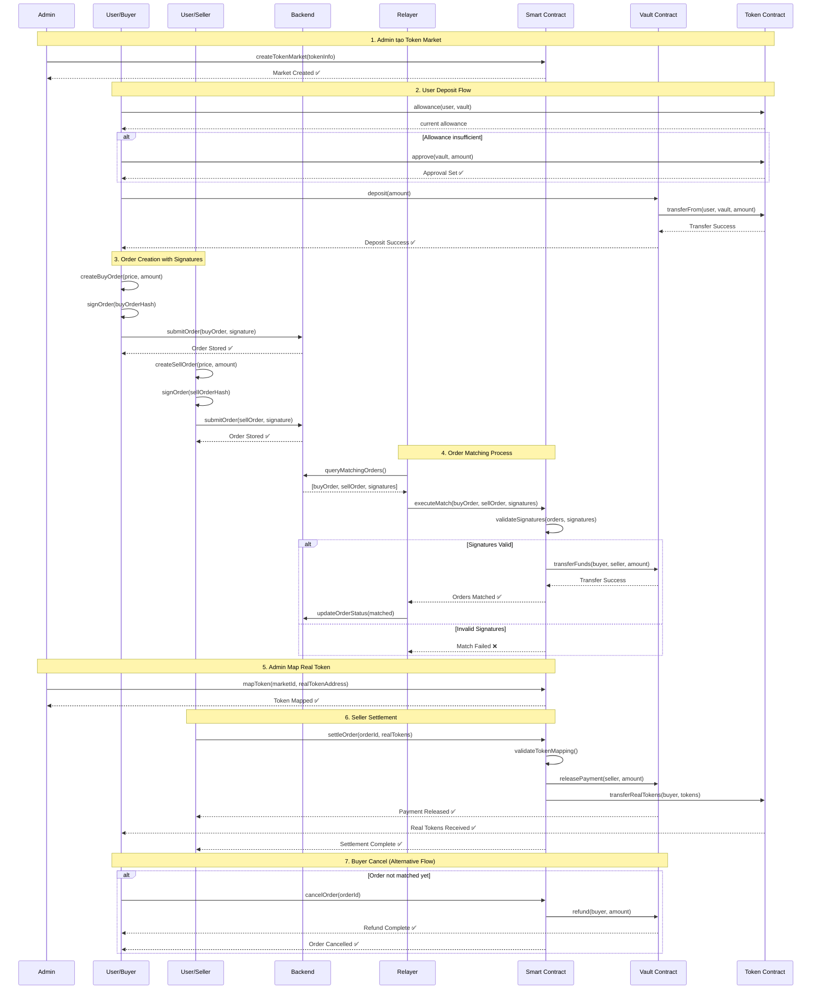

# Pre-Market Trading System - Diagrams

## Files có sẵn

- `premarket-flow.mmd` - Flowchart diagram (business process)
- `premarket-sequence.mmd` - Sequence diagram (technical interactions)

## Cách xem diagrams

### 1. Trên GitHub/GitLab
- Mở file `.mmd` trực tiếp trên GitHub/GitLab
- Diagram sẽ tự động render thành hình ảnh

### 2. Trên VS Code  
- Cài extension "Mermaid Preview" 
- Mở file `.mmd` và xem preview

### 3. Online Mermaid Editor
- Copy nội dung file `.mmd` 
- Paste vào https://mermaid.live/
- Có thể export PNG/SVG nếu cần

## 1. Flowchart - Business Process Flow

### Mô tả tổng quan luồng business

```mermaid
flowchart TD
    Start([Bắt đầu hệ thống Pre-Market Trading])
    
    %% Admin Flow
    AdminCreate[Admin: Tạo Token Market]
    MarketCreated{Market đã tạo?}
    
    %% User Deposit Flow
    UserDeposit[User: Muốn deposit vào Vault]
    CheckApproval{Đã approve token?}
    ApproveToken[User: Approve token cho Vault]
    DepositFunds[User: Deposit funds vào Vault]
    FundsLocked[Funds được lock trong Vault]
    
    %% Order Creation Flow
    CreateOrder[User: Tạo Order]
    SignOrder[User: Ký order với private key]
    StoreSignature[Backend: Lưu signature]
    
    %% Matching Flow
    RelayerQuery[Relayer: Query orders từ Backend]
    FindMatch{Tìm thấy matching orders?}
    ExecuteMatch[Relayer: Execute match với signatures]
    ValidateSignatures[Smart Contract: Validate signatures]
    SignaturesValid{Signatures hợp lệ?}
    TransferFunds[Smart Contract: Transfer funds qua Vault]
    OrderMatched[Orders được matched thành công]
    
    %% Post-Match Actions
    PostMatch{Seller muốn settle hay Buyer muốn cancel?}
    
    %% Settlement Flow
    AdminMap[Admin: Map token với real address]
    TokenMapped{Token đã được map?}
    SellerSettle[Seller: Settle order với real tokens]
    ReleasePayment[Smart Contract: Release payment cho Seller]
    TransferRealTokens[Smart Contract: Transfer real tokens cho Buyer]
    SettleComplete[Settlement hoàn tất]
    
    %% Cancel Flow
    BuyerCancel[Buyer: Cancel order]
    RefundBuyer[Smart Contract: Refund cho Buyer]
    CancelComplete[Cancel hoàn tất]
    
    End([Kết thúc])
    
    %% Flow connections
    Start --> AdminCreate
    AdminCreate --> MarketCreated
    MarketCreated -->|Có| UserDeposit
    MarketCreated -->|Không| AdminCreate
    
    UserDeposit --> CheckApproval
    CheckApproval -->|Không| ApproveToken
    CheckApproval -->|Có| DepositFunds
    ApproveToken --> DepositFunds
    DepositFunds --> FundsLocked
    
    FundsLocked --> CreateOrder
    CreateOrder --> SignOrder
    SignOrder --> StoreSignature
    
    StoreSignature --> RelayerQuery
    RelayerQuery --> FindMatch
    FindMatch -->|Không| RelayerQuery
    FindMatch -->|Có| ExecuteMatch
    
    ExecuteMatch --> ValidateSignatures
    ValidateSignatures --> SignaturesValid
    SignaturesValid -->|Không| RelayerQuery
    SignaturesValid -->|Có| TransferFunds
    TransferFunds --> OrderMatched
    
    OrderMatched --> PostMatch
    PostMatch -->|Settle| AdminMap
    PostMatch -->|Cancel| BuyerCancel
    
    AdminMap --> TokenMapped
    TokenMapped -->|Không| AdminMap
    TokenMapped -->|Có| SellerSettle
    SellerSettle --> ReleasePayment
    ReleasePayment --> TransferRealTokens
    TransferRealTokens --> SettleComplete
    SettleComplete --> End
    
    BuyerCancel --> RefundBuyer
    RefundBuyer --> CancelComplete
    CancelComplete --> End
    
    %% Styling with black text
    classDef adminStep fill:#ff9999,stroke:#333,stroke-width:2px,color:#000000
    classDef userStep fill:#99ccff,stroke:#333,stroke-width:2px,color:#000000
    classDef contractStep fill:#99ff99,stroke:#333,stroke-width:2px,color:#000000
    classDef relayerStep fill:#ffcc99,stroke:#333,stroke-width:2px,color:#000000
    classDef decision fill:#fff2cc,stroke:#d6b656,stroke-width:2px,color:#000000
    classDef startEnd fill:#e1d5e7,stroke:#9673a6,stroke-width:3px,color:#000000
    
    class AdminCreate,AdminMap adminStep
    class UserDeposit,CreateOrder,SignOrder,SellerSettle,BuyerCancel userStep
    class ValidateSignatures,TransferFunds,ReleasePayment,TransferRealTokens,RefundBuyer contractStep
    class RelayerQuery,ExecuteMatch,StoreSignature relayerStep
    class MarketCreated,CheckApproval,FindMatch,SignaturesValid,TokenMapped,PostMatch decision
    class Start,End startEnd
```

### Giải thích màu sắc

- 🔴 **Admin Steps**: Các hành động của Admin (tạo market, map token)
- 🔵 **User Steps**: Các hành động của User (deposit, tạo order, settle/cancel)  
- 🟢 **Smart Contract**: Các function của smart contract
- 🟠 **Relayer/Backend**: Các service off-chain
- 🟡 **Decision Points**: Các điểm kiểm tra điều kiện
- 🟣 **Start/End**: Điểm bắt đầu và kết thúc flow

## 2. Sequence Diagram - Technical Interactions

### Mô tả chi tiết message flow giữa các components

### Giải thích Sequence Diagram

**Participants:**
- **Admin**: Quản trị viên hệ thống
- **User/Buyer**: Người mua token pre-market
- **User/Seller**: Người bán token pre-market  
- **Backend**: Off-chain service lưu trữ orders
- **Relayer**: Service match orders và execute on-chain
- **Smart Contract**: Main contract xử lý logic
- **Vault Contract**: Quản lý funds
- **Token Contract**: ERC20 token

**Message Types:**
- `->>`: Synchronous call
- `-->>`: Return/Response
- `alt/else`: Conditional logic
- `Note over`: Phân nhóm các bước

## So sánh 2 loại diagram

| Aspect | Flowchart | Sequence Diagram |
|--------|-----------|------------------|
| **Mục đích** | Business process flow | Technical message flow |
| **Audience** | Business stakeholders | Developers, Architects |
| **Thế mạnh** | Decision points, loops | API calls, interactions |
| **Sử dụng khi** | Hiểu business logic | Design/Debug system |

## Cập nhật diagrams

- **Flowchart**: Edit file `premarket-flow.mmd`
- **Sequence**: Edit file `premarket-sequence.mmd`
- Commit changes lên git để cập nhật 